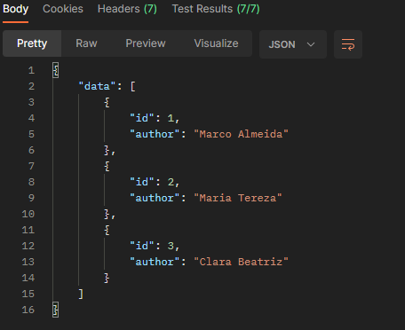
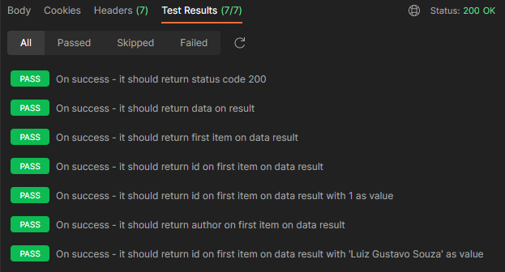

# MVP-01: GET authors endpoint

Deliveries:

 * a basic implementation that expose an author route
 * a GET endpoint that returns an author list ordered by id
 * a database in sqlite3 to store author records
 * steps documentation to do it from scratch

## Applied principles

 * DRY & KISS
   * use a [Project Template](https://gitlab.com/gitlab-org/project-templates/express).
   * use a simple data access [implementation](https://geshan.com.np/blog/2021/10/nodejs-sqlite/)
   * use Postman to test endpoint result
 * MVP
   * deliver a GET endpoint that returns author list
   * deliver a SQL script that insert initials authors
   * deliver a Postman request that tests retrieving authors data

### Postman request




curl:

``` bash
curl --location 'http://localhost:3000/authors'
```

Tests:

``` javascript
const result = pm.response.json();
const firstItem = pm.response.json().data[0];

pm.test("On success - it should return status code 200", () => {
    pm.expect(pm.response.code).to.equal(200);
});

pm.test("On success - it should return data on result", () => {
    pm.expect(result.data).to.exist;
});

pm.test("On success - it should return first item on data result", () => {
    pm.expect(firstItem).to.exist;
});

pm.test("On success - it should return id on first item on data result", () => {
    pm.expect(firstItem.id).to.exist;
});

pm.test("On success - it should return id on first item on data result with 1 as value", () => {
    pm.expect(firstItem.id).to.equal(1);
});

pm.test("On success - it should return author on first item on data result", () => {
    pm.expect(firstItem.author).to.exist;
});

pm.test("On success - it should return id on first item on data result with 'Luiz Gustavo Souza' as value", () => {
    pm.expect(firstItem.author).to.equal("Marco Almeida");
});
```
