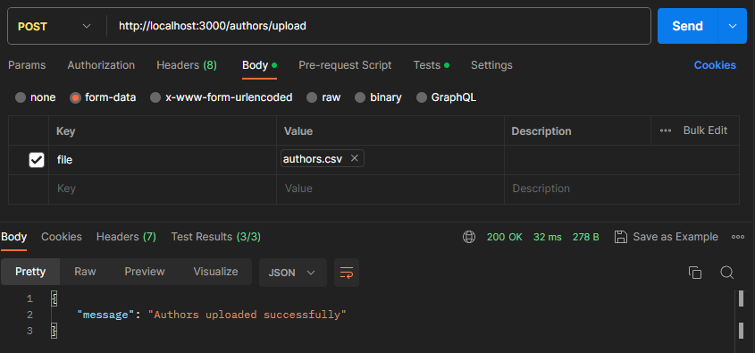

# MVP-03: POST books endpoint

Deliveries:

 * a POST endpoint that insert books according list uploaded in a file
 * fix tests on GET books endpoint
 * improve formatting in docs

## Applied principles

 * DRY & KISS
   * use a simple data access [implementation](https://geshan.com.np/blog/2021/10/nodejs-sqlite/)
   * use Postman to test endpoint result
 * MVP
   * deliver a POST endpoint that insert authors sent in a file
     * first line must be a header
     * first line must have 'author' value
     * other lines must have author name
   * use unique indexes to avoid duplicated inserts
   * deliver a Postman request that tests retrieving authors data

## Postman request

CSV file sample

``` text
author
Luciano Ramalho
Osvaldo Santana Neto
David Beazley
Chetan Giridhar
Brian K. Jones
J.K Rowling
```

curl:

``` bash
curl --location 'http://localhost:3000/authors/upload' \
--form 'file=@"./authors.csv"'
```



### Before authors insertion

curl:

``` bash
curl --location 'http://localhost:3000/authors'
```


