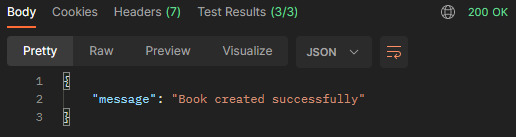

# MVP-05: POST book endpoint

Deliveries:

 * a POST endpoint that insert book
 * implement transaction on database operations
 * implement author insertion if not exists features
 * fix typo in docs

## Applied principles

 * DRY & KISS
   * use Postman to test endpoint result
 * MVP
   * deliver a POST endpoint that insert book
   * use dabasse transaction to rollback on error
   * deliver a Postman request that tests success or failure scenarios

## Postman request

### Postman request - error

``` bash
curl --location 'http://localhost:3000/books' \
--header 'Content-Type: application/json' \
--data '{
    "name": "A família Dorta Almeida",
    "edition": 1,
    "year": 2023,
    "authors": [
        "Maria Tereza",
        "Clara Beatriz",
        "Clara Carolina"
    ]
}'
```



#### Postman Tests

``` javascript
const result = pm.response.json();

pm.test("On success - it should return status code 200", () => {
    pm.expect(pm.response.code).to.equal(200);
});

pm.test("On success - it should return message on result", () => {
    pm.expect(result.message).to.exist;
});

pm.test("On success - it should return successfully message", () => {
    pm.expect(result.message).to.equal("Book created successfully");
});
```

### Postman request - insert error

``` bash
curl --location 'http://localhost:3000/books' \
--header 'Content-Type: application/json' \
--data '{
    "name": "A família Dorta Almeida",
    "edition": 1,
    "year": 2023,
    "authors": [
        "Maria Tereza",
        "Clara Beatriz",
        "Clara Carolina",
        ""
    ]
}'
```


#### Postman Tests

``` javascript
const result = pm.response.json();

pm.test("On success - it should return status code 200", () => {
    pm.expect(pm.response.code).to.equal(200);
});

pm.test("On success - it should return message on result", () => {
    pm.expect(result.message).to.exist;
});

pm.test("On success - it should return successfully message", () => {
    pm.expect(result.message).to.equal("Error creating book");
});
```
