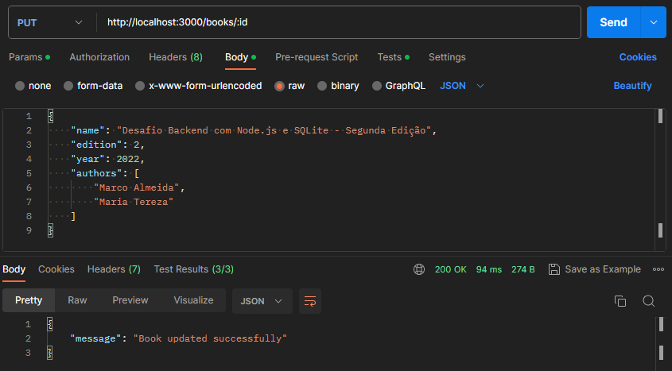
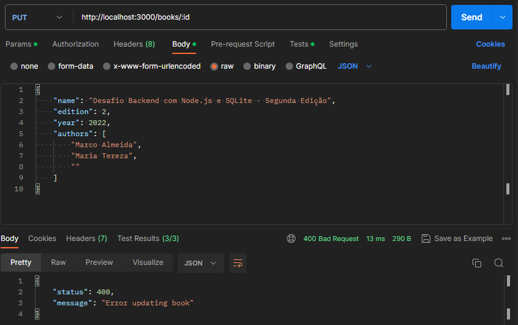

# MVP-06: PUT book endpoint

Deliveries:

 * a PUT endpoint that update book
 * implement transaction on database operations

## Applied principles

 * DRY & KISS
   * use Postman to test endpoint result
 * MVP
   * deliver a PUT endpoint that update book
   * use dabasse transaction to rollback on error
   * deliver a Postman request that tests success or failure scenarios

## Postman request

### PUT - update book

``` bash
curl --location --request PUT 'http://localhost:3000/books/2' \
--header 'Content-Type: application/json' \
--data '{
    "name": "Desafio Backend com Node.js e SQLite - Segunda Edição",
    "edition": 2,
    "year": 2022,
    "authors": [
        "Marco Almeida",
        "Maria Tereza"
    ]
}'
```



#### Postman Tests

``` javascript
const result = pm.response.json();

pm.test("On success - it should return status code 200", () => {
    pm.expect(pm.response.code).to.equal(200);
});

pm.test("On success - it should return message on result", () => {
    pm.expect(result.message).to.exist;
});

pm.test("On success - it should return successfully message", () => {
    pm.expect(result.message).to.equal("Book updated successfully");
});
```

### PUT - update book error

``` bash
curl --location --request PUT 'http://localhost:3000/books/2' \
--header 'Content-Type: application/json' \
--data '{
    "name": "Desafio Backend com Node.js e SQLite - Segunda Edição",
    "edition": 2,
    "year": 2022,
    "authors": [
        "Marco Almeida",
        "Maria Tereza",
        ""
    ]
}'
```



#### Postman Tests

``` javascript
const result = pm.response.json();

pm.test("On success - it should return status code 400", () => {
    pm.expect(pm.response.code).to.equal(400);
});

pm.test("On success - it should return message on result", () => {
    pm.expect(result.message).to.exist;
});

pm.test("On success - it should return successfully message", () => {
    pm.expect(result.message).to.equal("Error updating book");
});
```
