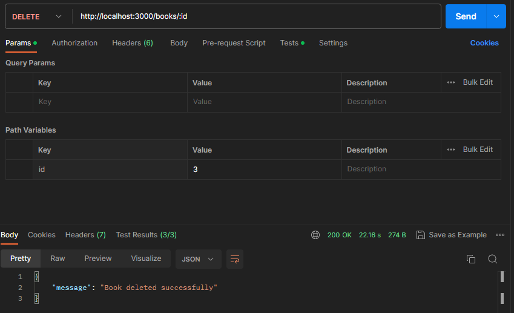
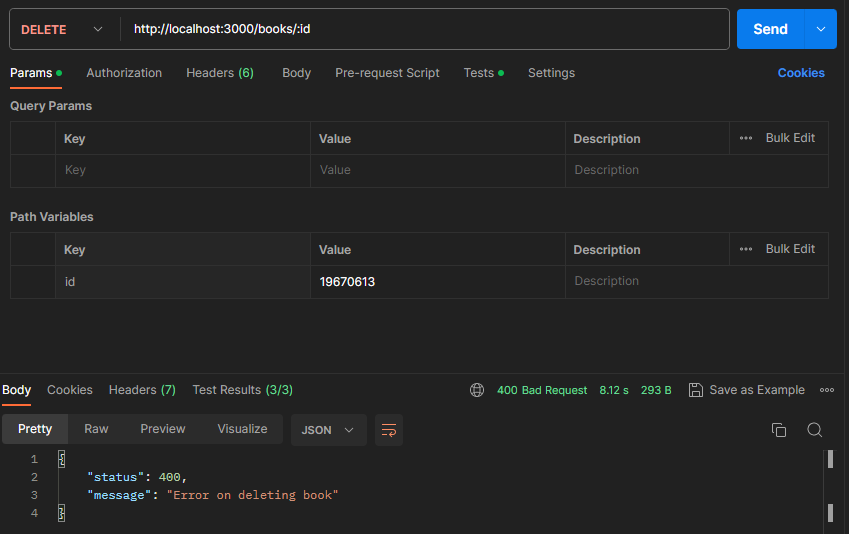

# MVP-07: DELETE book endpoint

Deliveries:

 * a DELETE endpoint that remove book
 * test success and failure on Postman

## Applied principles

 * DRY & KISS
   * use Postman to test endpoint result
 * MVP
   * deliver a DELETE endpoint that remove book
   * deliver a Postman request that tests success or failure scenarios

## Postman request

### DELETE - remove book

``` bash
curl --location --request DELETE 'http://localhost:3000/books/3'
```



#### Postman Tests

``` javascript
const result = pm.response.json();

pm.test("On success - it should return status code 200", () => {
    pm.expect(pm.response.code).to.equal(200);
});

pm.test("On success - it should return message on result", () => {
    pm.expect(result.message).to.exist;
});

pm.test("On success - it should return error message", () => {
    pm.expect(result.message).to.equal("Book deleted successfully");
});
```

### DELETE - remove book error

``` bash
curl --location --request DELETE 'http://localhost:3000/books/19670613'
```



#### Postman Tests

``` javascript
const result = pm.response.json();

pm.test("On success - it should return status code 400", () => {
    pm.expect(pm.response.code).to.equal(400);
});

pm.test("On success - it should return message on result", () => {
    pm.expect(result.message).to.exist;
});

pm.test("On success - it should return error message", () => {
    pm.expect(result.message).to.equal("Error on deleting book");
});
```
