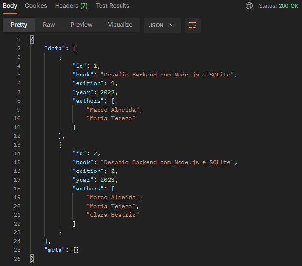
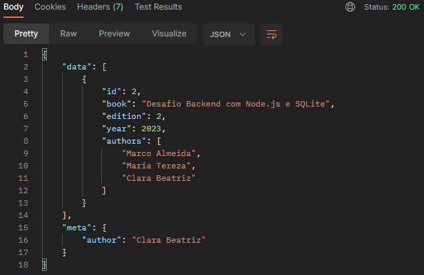
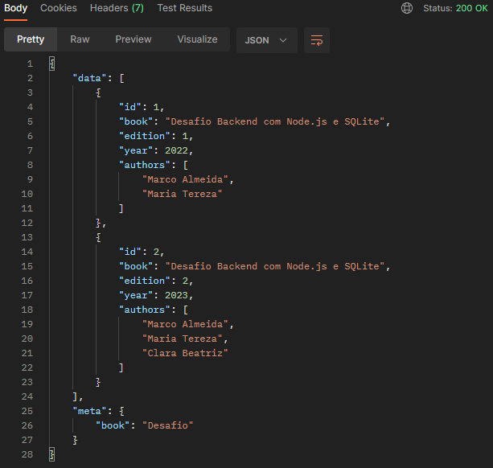
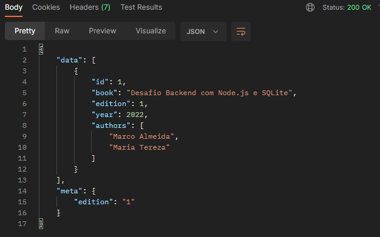
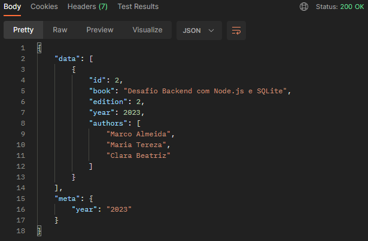

# MVP-02: GET books endpoint

Deliveries:

 * a basic implementation that expose an books route
 * a GET endpoint that returns an books list ordered by id
 * store books records and books authors relation

## Applied principles

 * DRY & KISS
   * use a simple data access [implementation](https://geshan.com.np/blog/2021/10/nodejs-sqlite/)
   * use Postman to test endpoint result
   * use querystring to filter books
 * MVP
   * deliver a GET endpoint that returns books list filtering:
     * by book name using like operator
     * by book edition
     * by publication year 
     * a specific author
   * deliver a SQL script that insert initials books
   * deliver a SQL script that insert initials books author relation
   * use unique indexes to avoid duplicated inserts
   * deliver a Postman request that tests retrieving authors data

## Postman request

### Postman request - no filter

``` bash
curl --location 'http://localhost:3000/books'
```



### Postman request - by author

``` bash
curl --location 'http://localhost:3000/books?author=Clara%20Beatriz'
```



### Postman request - by book

``` bash
curl --location 'http://localhost:3000/books?book=Desafio'
```


### Postman request - by edition

``` bash
curl --location 'http://localhost:3000/books?edition=1'
```



### Postman request - by year

``` bash
curl --location 'http://localhost:3000/books?year=2023'
```



### Postman Tests

``` javascript
const result = pm.response.json();
const firstItem = pm.response.json().data[0];

pm.test("On success - it should return status code 200", () => {
    pm.expect(pm.response.code).to.equal(200);
});

pm.test("On success - it should return data on result", () => {
    pm.expect(result.data).to.exist;
});

if (firstItem) {
    pm.test("On success - it should return first item on data result", () => {
        pm.expect(firstItem).to.exist;
    });

    pm.test("On success - it should return id on first item on data result", () => {
        pm.expect(firstItem.id).to.exist;
    });

    pm.test("On success - it should return authors on first item on data result", () => {
        pm.expect(firstItem.authors).to.exist;
    });
}

if (pm.request.url.query.has('year')) {
    const year = pm.request.url.query.get('year');
    pm.test("On success - it should return year on meta equals to on query", () => {
        pm.expect(`${result.meta.year}`).to.equal(year);
    });
    if (firstItem) {
        pm.test("On success - it should return year on firstItem equals to on query", () => {
            pm.expect(`${firstItem.year}`).to.equal(year);
        });
    }
}

if (pm.request.url.query.has('edition')) {
    const edition = pm.request.url.query.get('edition');
    pm.test("On success - it should return edition on meta equals to on query", () => {
        pm.expect(`${result.meta.edition}`).to.equal(edition);
    });
    if (firstItem) {
        pm.test("On success - it should return edition on firstItem equals to on query", () => {
            pm.expect(`${firstItem.edition}`).to.equal(edition);
        });
    }
}

if (pm.request.url.query.has('book')) {
    const book = pm.request.url.query.get('book');
    pm.test(`On success - it should return book on meta containing ${book}`, () => {
        pm.expect(result.meta.book).to.equal(book);
    });
    if (firstItem) {
        pm.test(`On success - it should return book on firstItem containing ${book}`, () => {
            pm.expect(firstItem.book).to.contain(book);
        });
    }
}

if (pm.request.url.query.has('author')) {
    const author = decodeURI(pm.request.url.query.get('author'));

    pm.test(`On success - it should return author on meta containing ${author}`, () => {
        pm.expect(result.meta.author).to.equal(author);
    });
    if (firstItem) {
        pm.test(`On success - it should return book on firstItem containing ${author}`, () => {
            pm.expect(firstItem.authors).to.include(author);
        });
    }
}
```
