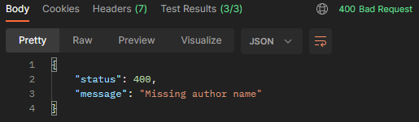
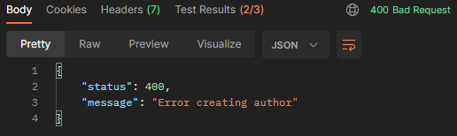

# MVP-04: POST author endpoint

Deliveries:

 * a POST endpoint that insert author
 * avoid duplication author insertion
 * fix error rendering
 * fix typo in docs

## Applied principles

 * DRY & KISS
   * use Postman to test endpoint result
 * MVP
   * deliver a POST endpoint that insert author
     * json must have 'name' property
     * json property 'name' must have a value
   * use unique indexes to avoid duplicated inserts
   * deliver a Postman request that tests retrieving authors data

## Postman request


### POST - insert author

curl:

``` bash
curl --location 'http://localhost:3000/authors/' \
--header 'Content-Type: application/json' \
--data '{
    "name": "Nome do autor"
}'
```


#### Postman tests

``` javascript
const result = pm.response.json();

pm.test("On success - it should return status code 200", () => {
    pm.expect(pm.response.code).to.equal(200);
});

pm.test("On success - it should return message on result", () => {
    pm.expect(result.message).to.exist;
});

pm.test("On success - it should return successfully message", () => {
    pm.expect(result.message).to.equal("Author created successfully");
});
```

### POST - error no author name

``` bash
curl --location 'http://localhost:3000/authors/' \
--header 'Content-Type: application/json' \
--data '{
    "authorName": "Wrong property name"
}'

curl --location 'http://localhost:3000/authors/' \
--header 'Content-Type: application/json' \
--data '{
    "name": ""
}'
```



#### Postman Tests

``` javascript
const result = pm.response.json();

pm.test("On success - it should return status code 400", () => {
    pm.expect(pm.response.code).to.equal(400);
});

pm.test("On success - it should return message on result", () => {
    pm.expect(result.message).to.exist;
});

pm.test("On success - it should return successfully message", () => {
    pm.expect(result.message).to.equal("Missing author name");
});
```

### POST - error duplicated author

``` bash
curl --location 'http://localhost:3000/books'
```



#### Postman Tests

``` javascript
const result = pm.response.json();

pm.test("On success - it should return status code 400", () => {
    pm.expect(pm.response.code).to.equal(400);
});

pm.test("On success - it should return message on result", () => {
    pm.expect(result.message).to.exist;
});

pm.test("On success - it should return successfully message", () => {
    pm.expect(result.message).to.equal("Error creating author");
});
```
