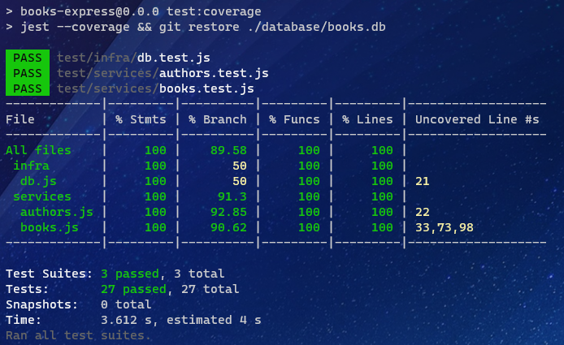

# MVP-09: Tests with Jest

Deliveries:

 * create tests to author services
 * create tests to book services
 * configure jest in project
 * configure code coverage

## Applied principles

 * DRY & KISS
   * use jest as test framework
   * refactor to allow IOC/DI pattern
   * implement a simple injection solution
 * MVP
   * test author service
   * test books service
   * implement a simple injection solutions
   * achieve 100% on author and books service

## Test results

## Improvements applyed

Add inTransaction property to check open transactions on db implementation enabling validation to test porpouse.

Change author and book services to:

 * a class implementation
 * receive db instance on constructor

This will allow use of IOC/DI features and decouple dependecy to a better test approach.
